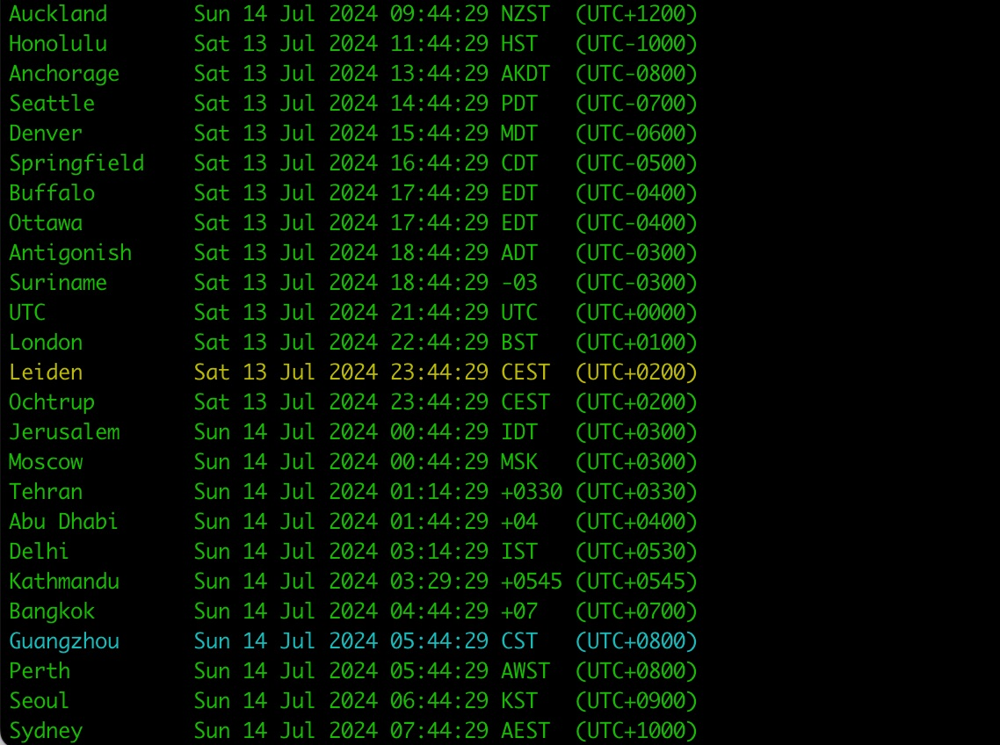

# wnow
wnow simple Python command line moving digital world clock

works on Windows, Linux, BSD and macOS

you may need to make some small changes depending on your system:

use backports.zoneinfo if zoneinfo is not available

use either of COLORS or COLOR_PAIRS depending on your OS (COLOR_PAIRS for Windows)

future implementations shall make these changes automatically

